# macOS Monterey in VMware Workstation on Windows 11

This project demonstrates how to run macOS Monterey in VMware Workstation on a Windows 11 machine, specifically using a Dell Optiplex 7020. The goal is to enable macOS for personal and educational purposes.

This project was inspired by [this video tutorial](https://www.youtube.com/watch?v=WQTKPNvSgtQ).

## My PC Specifications

For reference, here are the specifications of the system I used for this project:

- **PC Model**: Dell Optiplex 7020
- **Processor**: Intel® Core™ i5 4570 3.2 GHz (4 cores)
- **Memory**: 2x4GB dual-channel DDR3-SDRAM 1600 MHz
- **Storage**: 256GB SSD (SATA, not M.2)
- **Graphics**: Nvidia GeForce GTX 1050

### Installation Experience

While I was able to successfully install macOS Monterey on this setup, the performance was quite poor and laggy. This was likely due to the relatively weak hardware, particularly the i5-4570 processor with only 4 cores and the 8GB of RAM. Running macOS in a virtualized environment on such limited resources is challenging, and the experience was far from smooth.

### My Recommendation

As an Apple user who also owns a MacBook, I would recommend purchasing a legitimate Mac if your goal is to use macOS for daily tasks or production work. The performance and experience on actual Apple hardware are vastly superior to running a virtualized Hackintosh, especially on systems with weaker specifications like mine. If you can afford a Mac, it will provide a much better experience overall, with excellent performance and compatibility.

## Prerequisites

1. **VMware Workstation Pro** (recommended) or **VMware Workstation Player**: [Download VMware Workstation](https://www.vmware.com/products/workstation-player.html)
2. **macOS Monterey ISO**: A macOS Monterey `.iso` file (instructions below on how to create it).
3. **macOS Unlocker for VMware**: The tool to enable macOS as a guest OS in VMware. You can download it from:
   - Pre-built version: [DrDonk's VMware Unlocker (v4.2.7 release)](https://github.com/DrDonk/unlocker/releases/tag/v4.2.7)
   - Full source code: [DrDonk's VMware Unlocker GitHub Repository](https://github.com/DrDonk/unlocker)

## Creating the macOS Monterey ISO

### Important Note

To create the macOS Monterey ISO as described in this guide, **you will need access to a MacBook** or other macOS-running hardware to download the installer and follow the steps.

### Alternative Methods

There are other ways to obtain macOS ISO files from the internet, and I have seen various solutions that allow you to download pre-built ISOs. However, **I do not recommend** using these methods. Downloading macOS from unofficial sources can be risky, as you might encounter security issues, corrupted files, or software that doesn't work as intended. It's always better to create the ISO file yourself using a legitimate Mac, ensuring the file's integrity and avoiding potential legal or security concerns.

---

I created the macOS Monterey ISO on my M1 MacBook Air by following these steps:

### 1. **Download the macOS Monterey Installer**

Ensure you have downloaded the macOS Monterey installer from the Mac App Store. It should be saved in the `/Applications` folder as `Install macOS Monterey.app`.

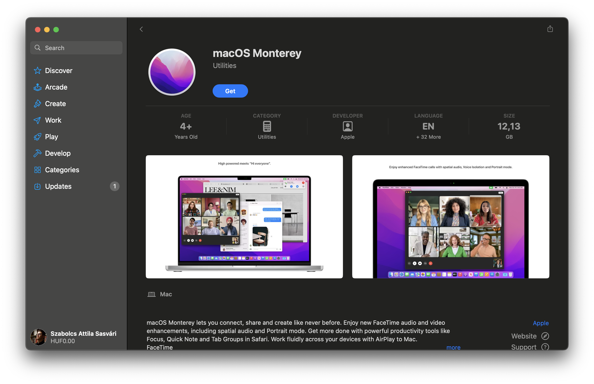

### 2. **Convert the Installer to ISO**

To convert the macOS Monterey app into an ISO for use in a virtual machine, follow these steps:

#### Step 1: Create a Disk Image
Open **Terminal** and run the following command to create a 16GB disk image on your Desktop:
```bash
hdiutil create -o ~/Desktop/Monterey.cdr -size 16384m -layout SPUD -fs HFS+J
```

#### Step 2: Mount the Disk Image
```bash
hdiutil attach ~/Desktop/Monterey.cdr.dmg -noverify -mountpoint /Volumes/install_build
```

#### Step 3: Write the Installer Files to the Disk Image
```bash
sudo /Applications/Install\ macOS\ Monterey.app/Contents/Resources/createinstallmedia --volume /Volumes/install_build
```

#### Step 4: Unmount the Disk Image
```bash
hdiutil detach /Volumes/Install\ macOS\ Monterey
```

#### Step 5: Convert the Disk Image to ISO
```bash
hdiutil convert ~/Desktop/Monterey.cdr.dmg -format UDTO -o ~/Desktop/Monterey.iso
```

#### Step 6: Rename the `.iso` File
```bash
mv ~/Desktop/Monterey.iso.cdr ~/Desktop/Monterey.iso
```

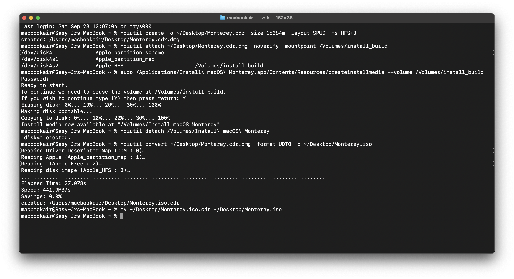

Now, you have a file named `Monterey.iso` on your Desktop that you can use as the ISO file for your virtual machine.

## Steps

### 1. Download and Install VMware Workstation Pro or Player

- Go to the [VMware Workstation Player website](https://www.vmware.com/products/workstation-player.html) to download either **VMware Workstation Pro** (which I have installed) or **VMware Workstation Player**.
- Download and install the latest version on your Windows 11 machine.

## macOS Unlocker for VMware

To enable macOS installation on VMware, the **VMware Unlocker** tool is required. This unlocker allows VMware to support macOS as a guest operating system.

- Pre-built version: [DrDonk's VMware Unlocker (v4.2.7 release)](https://github.com/DrDonk/unlocker/releases/tag/v4.2.7)
- Full source code: [DrDonk's VMware Unlocker GitHub Repository](https://github.com/DrDonk/unlocker)

### **Important Warning**

I used **DrDonk's VMware Unlocker** in this guide, but I want to stress that:

- **I do not provide any warranty** for this tool.  
- It was downloaded and used at my own risk, and I have **not checked** it for viruses, malware, or any potential security issues.
- If you decide to use this tool, **proceed with caution**. Make sure to scan the files for any threats before running them, especially if your system contains important data.
  
Additionally, using **VMware Unlocker** could potentially **violate VMware's terms of service**. The tool modifies VMware's software to allow macOS installation on non-Apple hardware, which is not officially supported by VMware. Using this tool to bypass those restrictions may be against their policies, so be fully aware of the legal risks before proceeding.

My daily machine is my MacBook, and this Windows system is just my experimental playground. If you're concerned about security, please consider testing this unlocker in a virtualized or isolated environment. Always ensure your antivirus and firewall are active before running any tools downloaded from external sources.

---

### 2. Use DrDonk's VMware Unlocker (Pre-built `unlock.exe`)

#### Pre-built Unlocker (Recommended for Windows Users)

1. Download the **Unlocker** from [DrDonk's release page (v4.2.7)](https://github.com/DrDonk/unlocker/releases/tag/v4.2.7).

   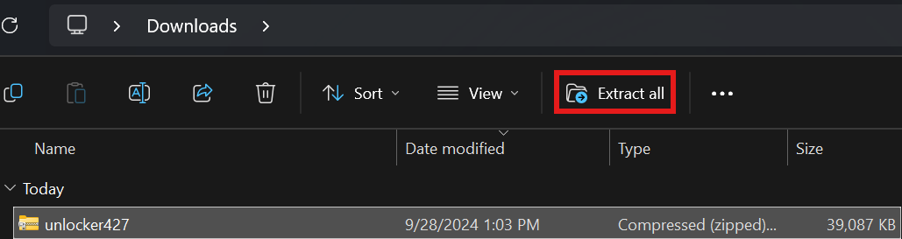

2. Extract the ZIP file and navigate to the `Windows` folder.

   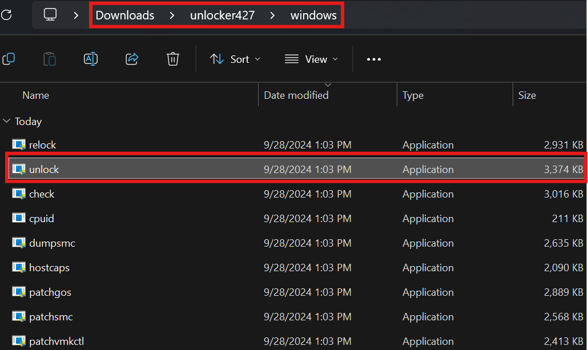

3. **Right-click on `unlock.exe`** and choose **Run as Administrator**.

   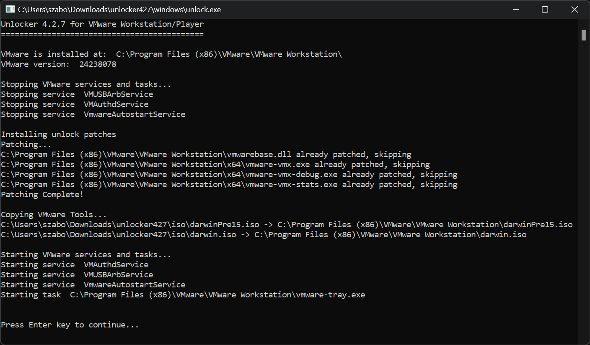

   **<ins>FYI: the output will be different for the first time, since I have already unlocked vmware.</ins>**

4. Once the patching process completes, restart your PC.
5. Open VMware Workstation Pro or Player and verify that **Apple Mac OS X** is available as a guest OS option.

### 3. Create a macOS Virtual Machine in VMware Workstation

1. Open VMware Workstation Pro or Player and click **Create a New Virtual Machine**.

   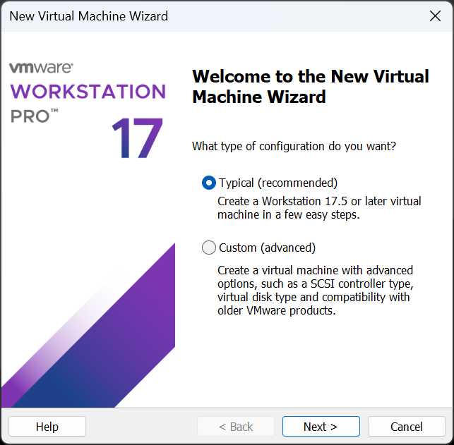

2. Select **Installer disc image file (iso)** and choose the macOS Monterey `.iso` file.

   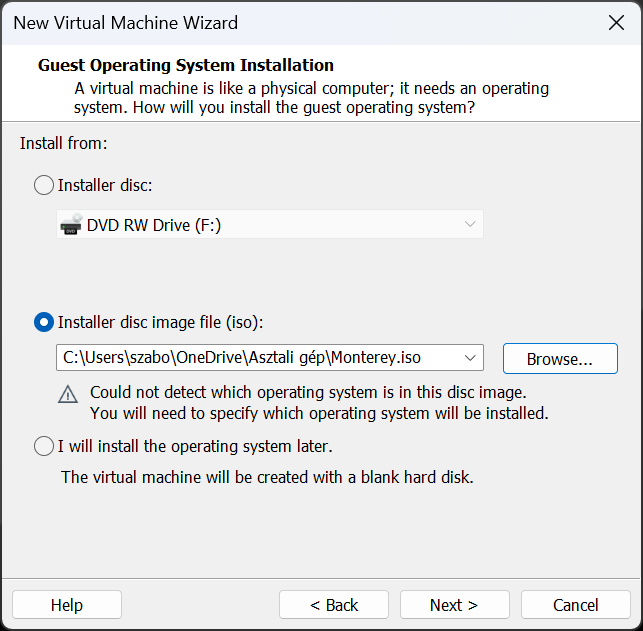

3. Set the **Guest Operating System** to **Apple macOS**, and choose **macOS 12**.

   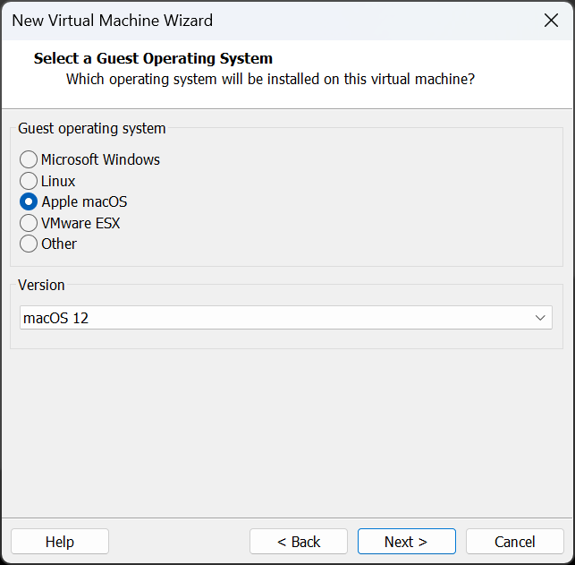

4. Name the virtual machine “macOS Monterey” and select a location.

   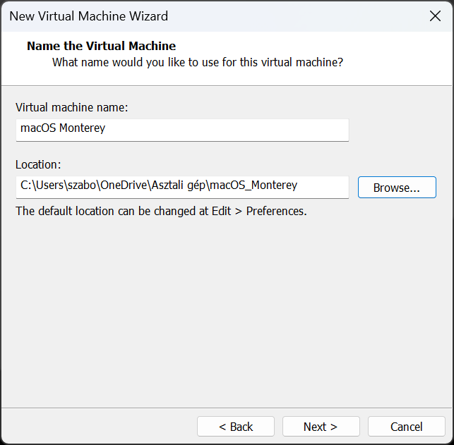

5. Allocate at least **80 GB** of disk space and use the option "Store virtual disk as a single file".

   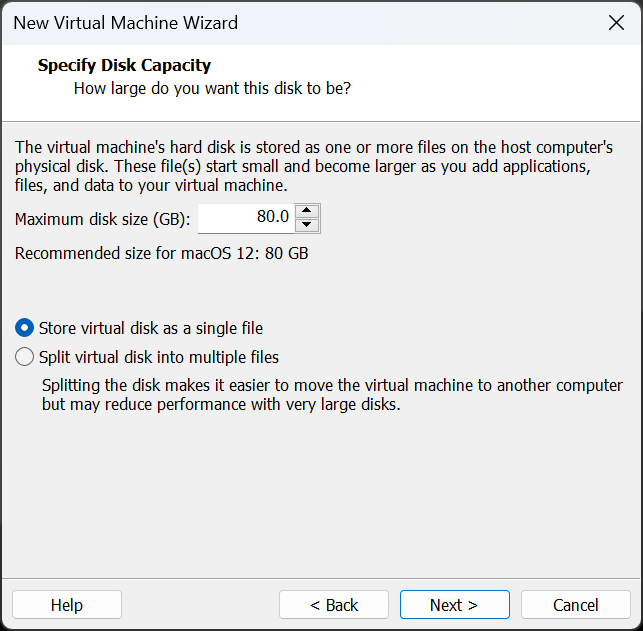

### 4. Configure Virtual Machine Settings

- **Memory**: Assign at least 4 GB (8 GB recommended).
- **Processors**: Set to 2 or more processors.
- **Hard Disk**: At least 80 GB.

   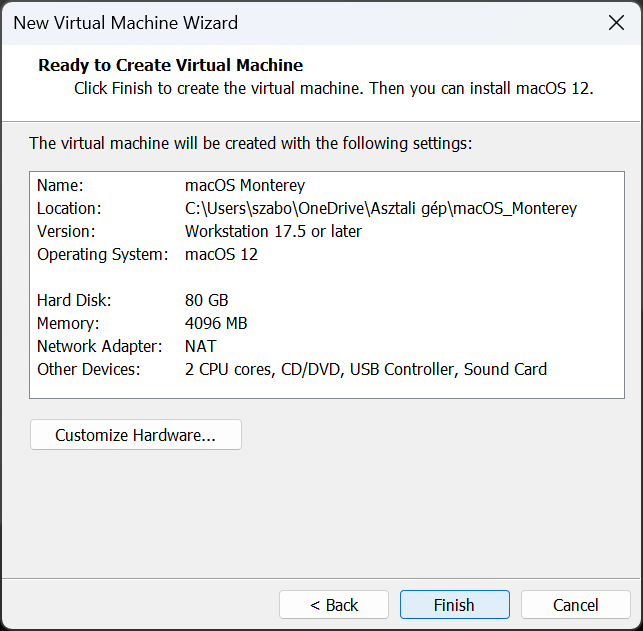

### 5. Edit the `.vmx` File

1. Close VMware Workstation.
2. Navigate to the folder where your virtual machine files are stored (e.g., `Documents\Virtual Machines\macOS Monterey`).

   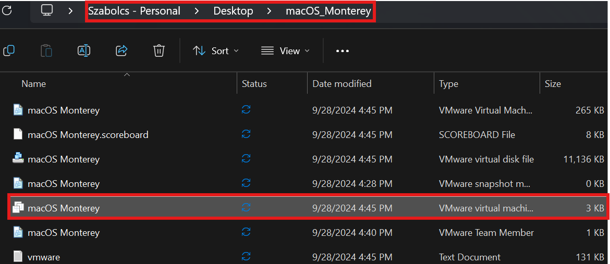

3. Open the `.vmx` file in a text editor.

4. Add the following line at the end of the file:
   ```bash
   smc.version = "0"
   ```

   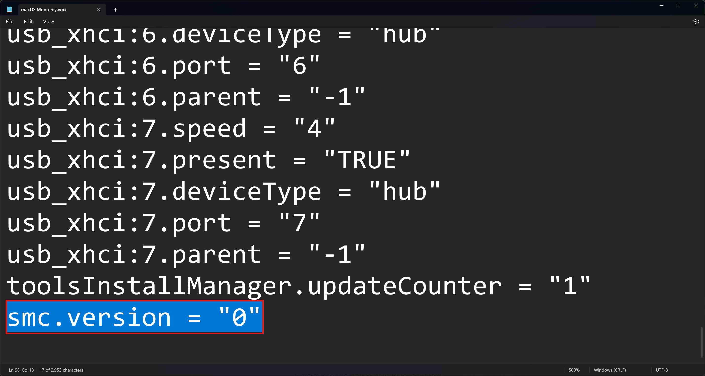

5. Save and close the file.

### 6. Start the macOS Virtual Machine

- Open VMware Workstation Pro or Player.
- Start the macOS Monterey virtual machine.
- The macOS installer should boot, and you can proceed with the installation on the virtual disk.

   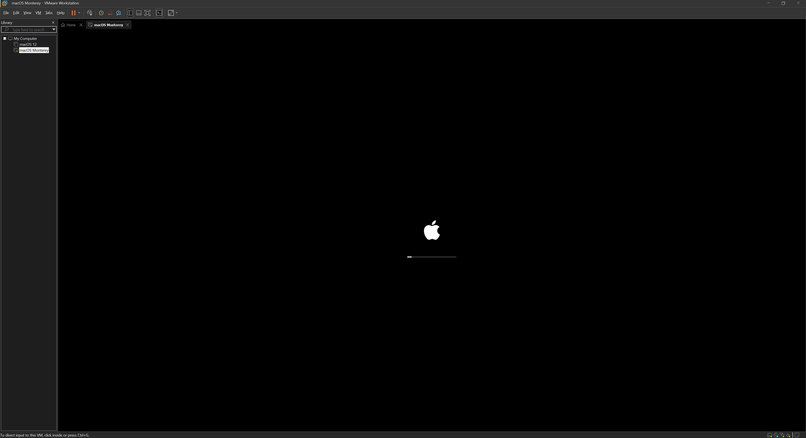

   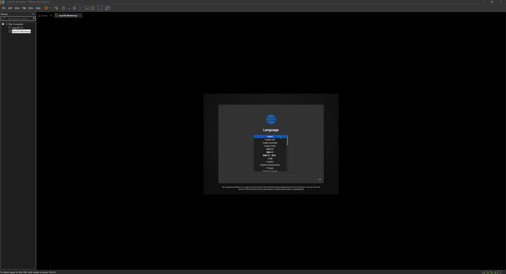

   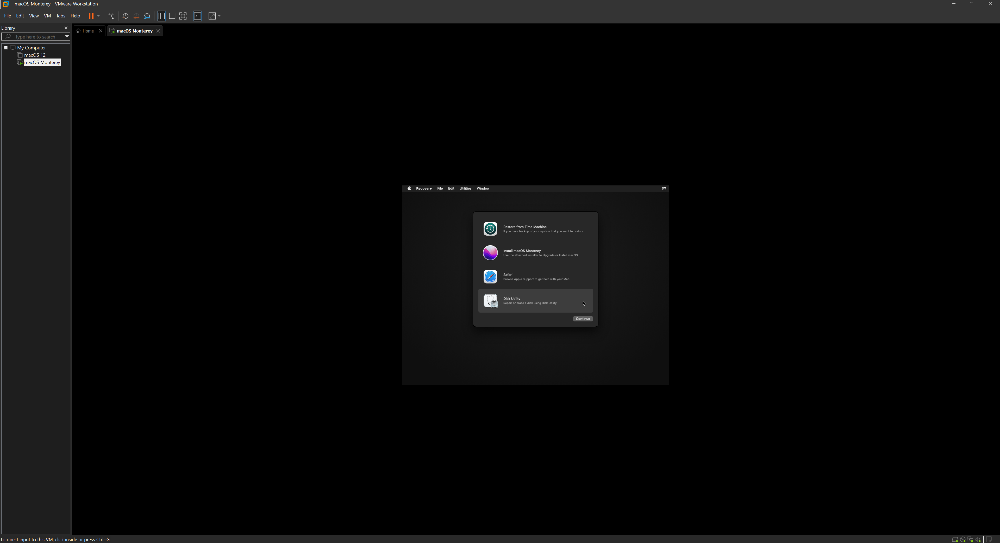

   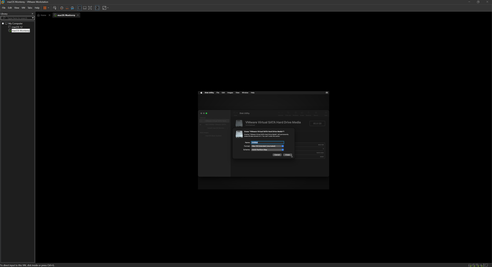

   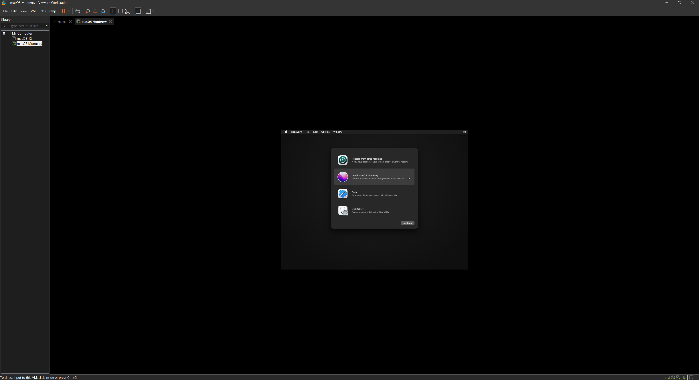

### 7. Install VMware Tools (Optional but Recommended)

1. Once macOS is installed, **eject the installation media** and go to **VM > Install VMware Tools**.

   

2. Follow the prompts to install the tools. This will improve the performance and enable features like full-screen resolution.

   

3. Restart the virtual machine once the tools are installed.

### 8. Result

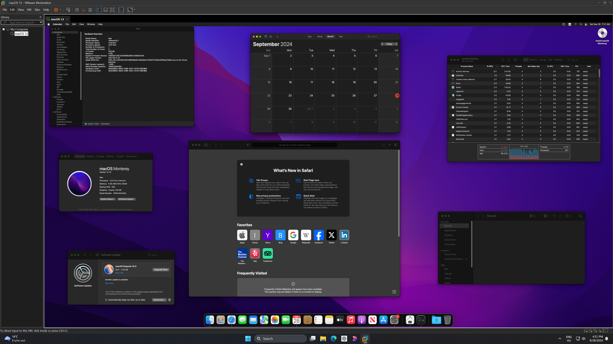

## Additional Information

### Troubleshooting

- **Performance Issues**: If the VM feels sluggish, increase the allocated RAM and CPU cores.
- **Boot Issues**: Double-check the `.vmx` file and ensure that macOS Unlocker was applied correctly.

### Legal Disclaimer ⚠️

**Important Notice**:  
This setup is intended for **personal and educational purposes only**. Apple’s End User License Agreement (EULA) states that macOS is only authorized to run on Apple-branded hardware. Although this guide walks through the technical process of running macOS on non-Apple hardware, it may **violate Apple’s terms of service**.

This project and the information provided here **are not a recommendation or endorsement** to violate software licensing agreements. If you choose to follow this guide, you do so **at your own risk**. It is your responsibility to understand and comply with the relevant legal agreements.

**This project and guide are solely for educational purposes**, and the author takes no responsibility for any legal or technical issues that may arise from its use.

## Inspiration

This project was inspired by [this YouTube video](https://www.youtube.com/watch?v=WQTKPNvSgtQ), which provided the initial idea and guidance for the process.

## License

This project is licensed under the MIT License. See the [LICENSE](LICENSE) file for details.
